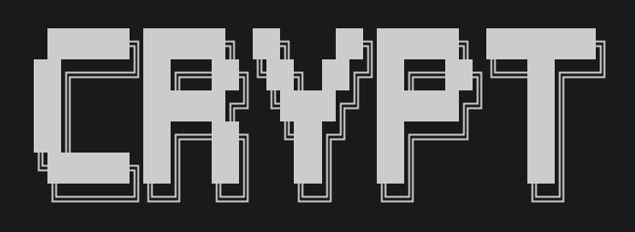

<p align="center">  </p> 


[](https://www.python.org/downloads/)
[](https://en.wikipedia.org/wiki/Command-line_interface)
[](#)
[](#)
## 📌 Overview
CRYPT is a lightweight command-line Python application that is used for basic credential storage and simple access control that can be used on Windows, Linux, and MacOS.

## ⚙️ Features
- Master password protection for access control
- Store account credentials
- Retrieve saved data
- Simple and easy-to-use command-line interface

## 💻 How to use
### Main Menu Options:
```
 1. Password Management
 2. Reset CRYPT Password 
 3. Exit
Option: 
```
- Password Management: Allows the user to access the different password management features of CRYPT
- Reset CRYPT Password: This option allows the user to reset their password for CRYPT
- Exit: This option terminates the program.
  
### Password Management Options: 
```
Choose option:
 1. Save new password
 2. Search for password
 3. Update password
 4. Delete password
 5. View all saved passwords
Option: 
```
- Save new password: This option allows the user to store new credentials.
- Search for password: This option searches for the account and password the user is looking for.
- Update password: This option allows the user to update one of their previously stored credentials.
- Delete password: This option deletes previously stored credentials selected by the user. 
- View all: This option allows the user to see a list of all saved data.


## ⚠️ Security Warning
CRYPT is still in its beta phase. The current version may contain security vulnerabilities or implementation mistakes. 
## ⚖️ License
This project is licensed under the MIT License.

 🏗️ CRYPT is still under development...
